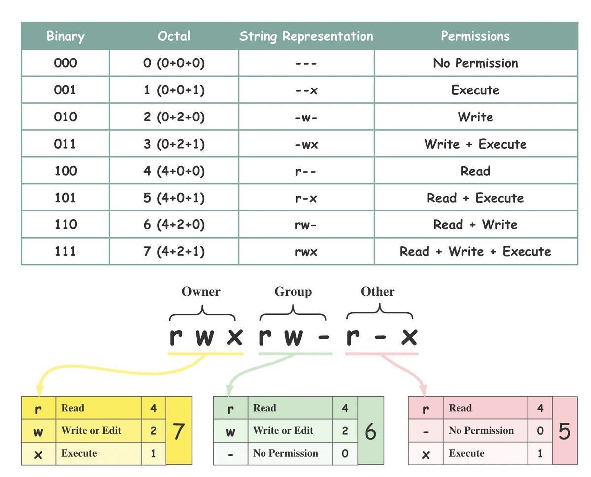

# Права доступа и владение в Linux

Чтобы разобраться с правами доступа к файлам в Linux, нужно чётко понимать два понятия: **Ownership** (владение) и **Permission** (права доступа).

## 🔐 Ownership (Владение)
Каждому файлу или каталогу назначаются три категории владельцев:

- **Owner (Владелец)** — пользователь, создавший файл или получивший на него права через `chown`.
- **Group (Группа)** — группа пользователей, которым назначены общие права на файл/каталог.
- **Other (Остальные)** — все остальные пользователи системы, не входящие ни в владельца, ни в группу файла.

## 📜 Permission (Права доступа)
Для каждой из трёх категорий владельцев существует ровно три типа прав:

- **Read (`r`)** — чтение. Для файла: открывать и просматривать содержимое. Для каталога: смотреть список файлов внутри (`ls`).
- **Write (`w`)** — запись. Для файла: изменять содержимое. Для каталога: создавать, переименовывать или удалять файлы внутри.
- **Execute (`x`)** — выполнение. Для файла: запускать как программу или скрипт. Для каталога: заходить в него (`cd`) и обращаться к файлам внутри по полному пути.

